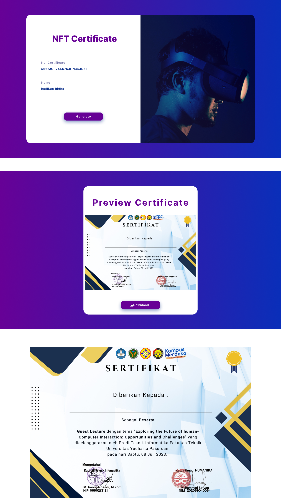

# DigitalinAjah: An NFT Certificate Generator For University Events

## Overview

This project is a minimalistic NFT Certificate Generator DApp that allows users to input a certificate number and name, then generates a certificate as an image. The image can be minted as an NFT on the Internet Computer blockchain.

## Features

- Input form to capture Certificate Number and Name.
- Preview of the generated certificate.
- Ability to download the certificate as an image (JPG/PNG).
- Integration with Internet Computer to mint the certificate as an NFT.
- Responsive design with a modern and minimalistic user interface.

## Tech Stack

- **Frontend:** React, HTML, CSS
- **Backend:** Node.js, Express
- **Blockchain Integration:** Internet Computer (ICP)
- **Storage:** Web3.Storage for storing the image files (optional)

## Installation

### Prerequisites

- Node.js
- npm or Yarn
- Internet Computer SDK (dfx)
- Web3.Storage API key (optional)
